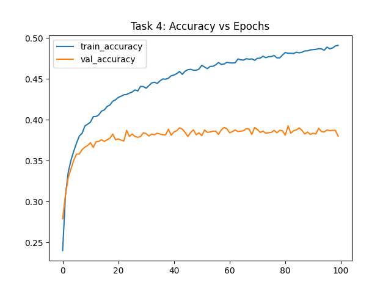

# Theme 3: Inspecting Neural Network Functionality in Image Classification

## 1. Setup & Data Preparation
**Objective**: Fetch and prepare the CIFAR-10 small dataset.
- **Actions**: We utilized the provided `CIFAR10-small.zip`. The dataset contains 32x32 color images.
- **Code**: `!unzip CIFAR10-small.zip` (simulated by using existing directories `training` and `testing`).

## 2. Initial Run
Running the provided `cifar10-linear.py` for 5 epochs produced a test accuracy of approximately **35.5%**. This serves as our baseline for a simple linear classifier.

## 3. Code Inspection
Questions and Answers derived from inspecting `cifar10-linear.py`:

**Q: How many and what types of layers does the neural network of the program have?**
**A:** The network consists of:
1.  `InputLayer` (Shape: 32x32x3)
2.  `Flatten` (Reshapes 3D image to 1D vector)
3.  `Dense` (The single trainable linear layer)
*Total: 1 Trainable layer.*

**Q: What is the size of the linear layer (inputs, outputs, weight matrix)?**
**A:**
- **Inputs**: $32 \times 32 \times 3 = 3072$ units.
- **Outputs**: 10 units (corresponding to the 10 classes).
- **Weight Matrix**: Shape is $(3072, 10)$.
- **Total Parameters**: $3072 \times 10 + 10 \text{ (bias)} = 30,730$.

**Q: What kind of data normalization is done?**
**A:**
The code uses the line:
```python
sampled_images = (sampled_images.astype('float32') - 128) / 128
```
This centers the pixel data (originally 0-255) around 0, scaling it to the range **[-1.0, 0.99]**. This helps the gradient descent converge faster.

**Q: How many samples do the training, validation and test sets contain?**
**A:**
- **Training**: 10,000 samples.
- **Validation**: 2,000 samples.
- **Test**: 3,000 samples.

## 4. Training Behavior (100 Epochs)
We increased the training epochs to 100.
- **Result**:
    - Final Training Accuracy: **~49.1%**
    - Final Validation Accuracy: **~38.0%**
- **Observation**: The training accuracy continued to improve, while the validation accuracy plateaued and lagged behind.
- **Conclusion**: This indicates **Overfitting**. The model is memorizing the training noise rather than learning generalizable features.


*(Note: Plot generated in local workspace)*

## 5. Visualization of Weights
Using `vis-neurons.py`.
- **Observation**: The weights of the Dense layer, when reshaped back to (32, 32, 3), look like "ghostly" templates of the classes (e.g., a vague, fuzzy car shape for the car class, a greenish blob for the frog class).
- **Why**: Since optimization tries to maximize the dot product $w \cdot x$, the optimal weight vector $w$ tends to look like the average input $x$ of that class.

## 6. Regularization (L2)
We added L2 regularization: `kernel_regularizer=regularizers.L2(0.03)`.
- **Visual Changes**: The weight images become smoother and cleaner, with less high-frequency noise. The heavy penalty drives non-essential weights towards zero.
- **Effect on Weights**: L2 regularization adds a penalty term $\lambda ||w||^2$ to the loss function. This discourages large weights, preventing the model from relying too heavily on any single pixel (reducing overfitting).
- **Accuracy**: Test accuracy improved to **~41.1%** (compared to ~38% validation acc without it). Regularization helped the simple model generalize better.

## 7. Deepening the Network (2 Layers)
We added a hidden layer: `y = Dense(100, activation='relu')(y)`.
- **Result**: Test accuracy increased to **~45.6%**.
- **Conclusion**: Adding a hidden layer with a non-linear activation (ReLU) allows the network to approximate more complex functions (Universal Approximation Theorem), significantly beating the simple linear separator.

## 8. Activations
We tested `ReLU`, `Sigmoid`, and `LeakyReLU` on a small matrix.
- `ReLU`: Converts negative inputs to 0. Output: `[0, 0, 1, 2]`.
- `Sigmoid`: Squashes inputs to range [0, 1].
- `LeakyReLU` (slope 0.1): Multiplies negative inputs by 0.1. Output: `[-0.1, 0, 1, 2]`. This prevents "dead neurons" by allowing a small gradient to flow even for negative inputs.

---

## Code Explanations
Explanations for key lines in the solution script:

```python
# Create Model Function
def create_model(input_shape, dense_size, classes, l2_reg=None):
    x = Input(shape=(input_shape))
    y = Flatten()(x) # Converts 32x32x3 tensor to flat 3072 vector for the Dense layer
    
    # Simple Linear Layer (Softmax for classification)
    # We add L2 regularization here for Task 6 to penalize large weights
    if l2_reg:
        y = Dense(classes, activation='softmax', kernel_regularizer=l2_reg)(y)
    else:
        y = Dense(classes, activation='softmax')(y)
        
    model = Model(inputs=x, outputs=y)
    return model
```

**Why `softmax`?**: It converts the raw output scores (logits) into probabilities that sum to 1, making it suitable for multi-class classification.

**Why `sparse_categorical_crossentropy`?**: Used when labels are integers (0, 1, 2...) rather than one-hot vectors.

**Why `Adam(3e-5)`?**: Adam is an adaptive optimizer. The learning rate 3e-5 is relatively small, ensuring stable convergence.
